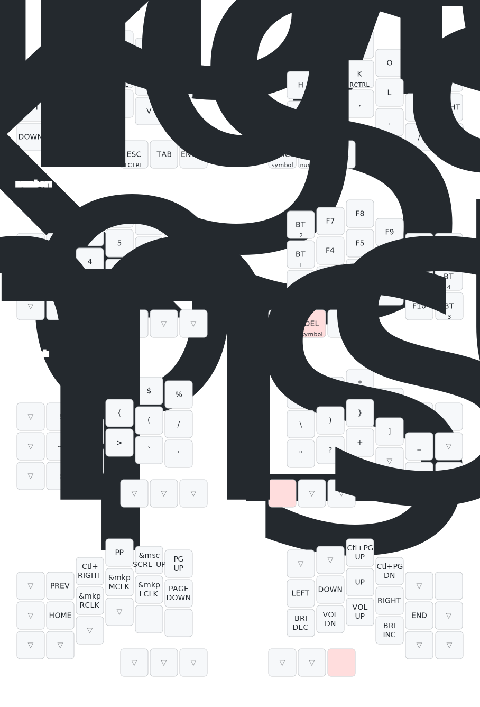

# crosses-42-zmk-template



The `keymap-visuals/` directory contains assets generated with
[keymap-drawer](https://github.com/caksoylar/keymap-drawer). Regenerate the SVG
after updating `config/crosses.keymap` with:

```sh
keymap parse -z config/crosses.keymap > keymap-visuals/crosses.yaml
keymap draw keymap-visuals/crosses.yaml > keymap-visuals/crosses.svg
```
